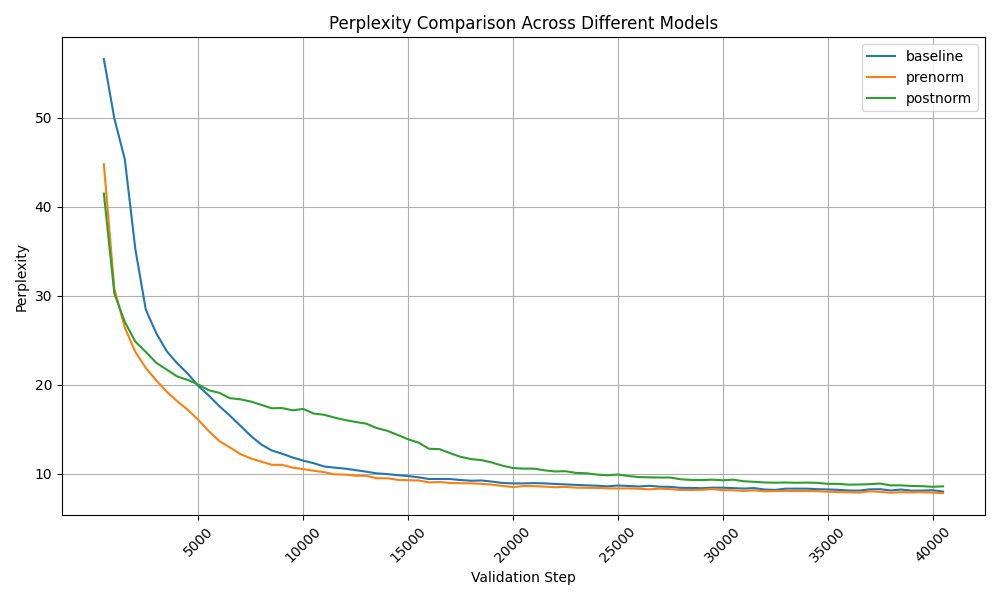

Luana Cheda, 
Janine Laura Hindermann

Forked GitHub repository exercise 4:
https://github.com/janinelaura-hindermann/mt-exercise-4

Forked GitHub repository hotfixed JoeyNMT:
https://github.com/janinelaura-hindermann/joeynmt

You find this document as a markdown in the `answers` directory too:
https://github.com/janinelaura-hindermann/mt-exercise-4/blob/main/answers/mt-2024-ex04%20answers.md

# 1. Understanding Code: LayerNorm in JoeyNMT

Taking a look at the [JoeyNMT repository](https://github.com/joeynmt/joeynmt), in the following files you can find layer normalization:
- `transformer_layers.py`
- `encoders.py`
- `decoders.py`

This is a short **overview of the explained classes** which are described in detail in this document:

- `PositionwiseFeedForward`
	- default: post-normalization
	- instance of "post"
- `TransformerEncoderLayer`
	- default: post-normalization
	- instance of "post"
- `TransformerDecoderLayer`
	- default: post-normalization
	- instance of "post"
- `TransformerEncoder`
	- instance of "pre"
	- sets  `TransformerEncoderLayer` to "pre" if nothing is specified (which was "post" before) and therefore also the dependent `PositionwiseFeedForward` to "pre"
- `TransformerDecoder`
	- instance of "post"
	- sets `TransformerDecoderLayer` to "post" if nothing is specified (which is already "post")


In the following code snippets, sometimes comments are removed and non-important code statements within the snippet are abbreviated with `...`. 
## transformer_layers.py

While taking a look at the class `PositionwiseFeedForward` you can see in the constructor that the default value for the layer normalization type is set to "post". This means, if you don't specify something, the **default behavior** is **post-normalization**.

```
class PositionwiseFeedForward(nn.Module):  
    def __init__(  
        self,  
        input_size: int,  
        ff_size: int,  
        dropout: float = 0.1,  
        alpha: float = 1.0,  
        layer_norm: str = "post",  
        activation: str = "relu",  
    ) -> None:
```

You can see as well, that there is no other option than that the variable has the value "pre" or "post" marked with this assert statement: 

```
assert self._layer_norm_position in {"pre", "post"}
```

In the `forward` function you can see how the variable `layer_norm_position` (new assigned variable with the value of `layer_norm`) is used:

```
def forward(self, x: Tensor) -> Tensor:  
    residual = x  
    if self._layer_norm_position == "pre":  
        x = self.layer_norm(x)  
  
    x = self.pwff_layer(x) + self.alpha * residual  
  
    if self._layer_norm_position == "post":  
        x = self.layer_norm(x)  
    return x
```

We can see that if the value is "pre", the layer normalization is executed **before** the function `pwff_layer` is called. If the value is "post", the layer normalization is called **after** the function `pwff_layer` (position-wise feed-forward layer).

The class `PositionwiseFeedForward` is instantiated by two other classes in the `transformer_layers.py` (`TransformerEncoderLayer` and `TransformerDecoderLayer`)

First taking a look at at `TransformerEncoderLayer`. In its constructor we can see, that the default value is "post". This means, if you don't specify something, the **default behavior** is **post-normalization**.

```
class TransformerEncoderLayer(nn.Module):  
    def __init__(  
        self,  
        size: int = 0,  
        ff_size: int = 0,  
        num_heads: int = 0,  
        dropout: float = 0.1,  
        alpha: float = 1.0,  
        layer_norm: str = "post",  
        activation: str = "relu",  
    ) -> None:
```

The value for `layer_norm` is passed without changing to the object instantiation of the class `PositionwiseFeedForward`. 

Here you can see as well the distinction between "pre" and "post" in the `forward` function. Here again, the `src_src_att` (MultiHeadedAttention) function is either called before or after the normalization step depending on the value.

```
def forward(self, x: Tensor, mask: Tensor) -> Tensor:  
    residual = x  
    if self._layer_norm_position == "pre":  
        x = self.layer_norm(x)  
  
    x, _ = self.src_src_att(x, x, x, mask)  
    x = self.dropout(x) + self.alpha * residual  
  
    if self._layer_norm_position == "post":  
        x = self.layer_norm(x)  
  
    out = self.feed_forward(x)  
    return out
```

Second taking a look at the `TransformerDecoderLayer`. Here we can see again, the default value is "post", so the **default behavior** is **post-normalization**.

```
class TransformerDecoderLayer(nn.Module):  
	def __init__(  
        self,  
        size: int = 0,  
        ff_size: int = 0,  
        num_heads: int = 0,  
        dropout: float = 0.1,  
        alpha: float = 1.0,  
        layer_norm: str = "post",  
        activation: str = "relu",  
    ) -> None:
```

Here too, the value for `layer_norm` is passed without changing to the object instantiation of the class `PositionwiseFeedForward`. 

Here too, you can see as well the distinction between "pre" and "post" in the `forward` function. 

```
def forward(...) -> Tensor:  
    # pylint: disable=unused-argument  
    # 1. target-target self-attention    
    residual = x  
    if self._layer_norm_position == "pre":  
        x = self.x_layer_norm(x)  
  
    h1, _ = self.trg_trg_att(x, x, x, mask=trg_mask)  
    h1 = self.dropout(h1) + self.alpha * residual  
  
    if self._layer_norm_position == "post":  
        h1 = self.x_layer_norm(h1)  
  
    # 2. source-target cross-attention  
    h1_residual = h1  
    if self._layer_norm_position == "pre":  
        h1 = self.dec_layer_norm(h1)  
  
    h2, att = self.src_trg_att(  
        memory, memory, h1, mask=src_mask, return_weights=return_attention  
    )  
    h2 = self.dropout(h2) + self.alpha * h1_residual  
  
    if self._layer_norm_position == "post":  
        h2 = self.dec_layer_norm(h2)   
    ...
```

Here again, the `trg_trg_att` (MultiHeadedAttention) and `trg_src_att` (MultiHeadedAttention) functions are either called before or after the normalization step depending on the value.

## encoders.py

In this file you find the class `TransformerEncoder` which creates instantiations of the previously mentioned class `TransformerEncoderLayer`. The constructor value `layer_norm` is passed by the `kwargs` argument. You can see how the `TransformerEncoderLayer`s are created. If there is no key named `layer_norm` in the `kwargs` of the `TransformerEncoder` instance,  the `layer_norm` value of the `TransformerEncoderLayer`s is "pre". 

```
class TransformerEncoder(Encoder):  
    def __init__(  
        self,  
        ...
        **kwargs,  
    ):  
        super().__init__()  
  
        self._output_size = hidden_size  
  
        # build all (num_layers) layers  
        self.layers = nn.ModuleList([  
            TransformerEncoderLayer(  
                size=hidden_size,  
                ff_size=ff_size,  
                num_heads=num_heads,  
                dropout=dropout,  
                alpha=kwargs.get("alpha", 1.0),  
                layer_norm=kwargs.get("layer_norm", "pre"),  
                activation=kwargs.get("activation", "relu"),  
            ) for _ in range(num_layers)  
        ])
```

This is the code for the stack of encoder layers. The initial set value of the variable `layer_norm` with the default value "post" is overwritten with the now set value "pre". So you have a **pre-normalization** here. 

Further we see the following code where the attribute `layer_norm` for the class `TransformerEncoder` is defined: 

```
self.layer_norm = (  
    nn.LayerNorm(hidden_size, eps=1e-6)  
    if kwargs.get("layer_norm", "post") == "pre" else None  
)
```

So these are the possibilities:
- `kwargs` does not contain a `layer_norm` key, therefore the code takes "post" since this is the default value. This doesn't evaluate to `True`, therefore is no LayerNorm created and `layer_norm` is `None`
- `kwargs` contains the key with the value "post": `layer_norm` is `None`
- `kwargs` contains the key with the value "pre": `layer_norm` is defined  

This variable `layer_norm` is then used in the`forward` function. It first iterates over every `TransformerEncoderLayer` (with pre-normalization) and reassigns `x`. Then in the if-statement it checks if the `layer_norm` was defined. If it is not `None`, meaning it was defined, and again this means that the value must be "pre", then normalization is applied. 

```
def forward(...) -> Tuple[Tensor, Tensor]:    
    ... 
  
    for layer in self.layers:  
        x = layer(x, mask)  
  
    if self.layer_norm is not None:  
        x = self.layer_norm(x) 
         
    return x, None
```

This seems to be an additional normalizing step at the end when all the layers have processed. Since this only happens if the value is "pre", but is done at the end of the encoding steps, it sounds counter-intuitive. 

## decoders.py

In this file you find the class `TransformerDecoder` which creates instantiations of the previously mentioned class `TransformerDecoderLayer`. On the first sight it looks very similar to the `TranformerEncoder`, but when taking a look at the instantiations of the `TransformerDecoderLayer`s you can see a difference: The default value is "post". So you have a **post-normalization** here. 

```
class TransformerDecoder(Decoder):  
    def __init__(  
        self,  
        ..  
        **kwargs,  
    ):  
        super().__init__()  
  
        self._hidden_size = hidden_size  
        self._output_size = vocab_size  
  
        # create num_layers decoder layers and put them in a list  
        self.layers = nn.ModuleList([  
            TransformerDecoderLayer(  
                size=hidden_size,  
                ff_size=ff_size,  
                num_heads=num_heads,  
                dropout=dropout,  
                alpha=kwargs.get("alpha", 1.0),  
                layer_norm=kwargs.get("layer_norm", "post"),  
                activation=kwargs.get("activation", "relu"),  
            ) for _ in range(num_layers)  
        ])
```

The default value from `TransformerDecoderLayer` is "post" too, so nothing happens.

We find exactly the same code snippets as in the `TransformerEncoder`:

```
self.layer_norm = (  
    nn.LayerNorm(hidden_size, eps=1e-6)  
    if kwargs.get("layer_norm", "post") == "pre" else None  
)
```

and

```
def forward(...) -> Tuple[Tensor, Tensor]:    
    ... 
  
    for layer in self.layers:  
        x = layer(x, mask)  
  
    if self.layer_norm is not None:  
        x = self.layer_norm(x) 
         
    return x, None
```

Since the `layer_norm` value is here "post", there is no `layer_norm` value defined. Meaning, the final normalization step is not done. The default behavior differs here: 

- `TransformerEncoder` → default "pre" → default behavior: final layer normalization
- `TransformerDecoder` → default "post"→ default behavior: **no** final layer normalization

So in short, if you don't specify the `layer_norm` in the config file (`.yaml` files), the whole Encoder part applies **pre-normalization** and the whole Decoder part applies **post-normalization**.

# 2. Implementing Pre- and Post-Normalization

## Implementation

We added configuration files for the pre- and post-normalization in the `config` directory:
- `model_pre.yaml`
- `model_post.yaml`

To extract the perplexities of the log file, please take a look at the `visualizaiton` directory.
There you can find the `extract_perplexities_from_logs.py` which creates a dataframe stored in a .csv file called `perplexity_comparison.csv`. 

To draw the table, run the `create_table.py` script:


To draw the line chart, run the `create_line_chart.py` script:


##  Discussion

**Given that there is a difference in the training progress for the three models, can you think of a reason for it?**

From the line chart above, we can see that there are differences in training progress between the baseline, pre-norm, and post-norm models. 
In this case, this difference could be attributed to the position of layer normalization within the model architecture.
The pre-norm model started from a higher perplexity (44.79) compared to the post-norm, but then demonstrated earlier and more stable reductions in perplexity, which may be due to the normalization being applied before the sub-layers. This configuration potentially stabilizes the input to each sub-layer, reducing internal covariate shifts and facilitating smoother gradient flow.
The post-norm model started off with a lower perplexity (41.5) but then it decreased at a slower rate than pre-norm, possibly due to the application of normalization after the residual connections. This setup might lead to challenges in gradient stability, especially in deeper networks, leading to slower initial progress in training.
These differences may suggest that the choice of normalization strategy can influence the learning dynamics and efficiency of the model, but since we kept the same hyperparameters we can’t conclude that one model is better than the other. It's plausible to consider that pre-norm configurations might bring a certain degree of robustness to model training, allowing for more consistent learning across various conditions. 

**Differences from Wang et. al. 2019**

Our experimental setup differs from Wang et. al. 2019 on a model depth level. They used much deeper models (up to 30 layers), focusing on the benefits of deep network architectures, which should be more sensitive to normalization strategies. Therefore, the models of the exercise, being less deep, may not fully replicate the amount of benefit observed by Wang et al. 2019 with pre-norm, as the benefits of this approach become more pronounced as the depth of the model increases.
Reading the paper by Wang et. al. 2019 we came to understand that they proposed an approach based on dynamic linear combination of layers (DLCL) to memorize the features extracted from all preceding layers. So perhaps by excluding DLCL we may not see the same level of performance improvement.
For these reasons, our results should be considered indicative rather than conclusive, reflecting the behavior of normalization strategies within the specific boundaries of our experimental parameters. At the same time made us reflect on how architectural choices can affect the performance of machine translation in neural models.

